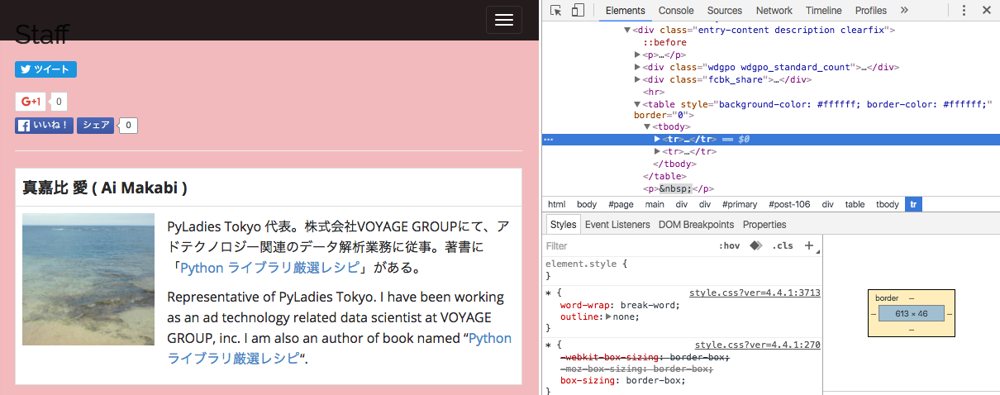

# Webスクレイピング入門 - PyLadies Tokyoハンズオン

## 環境構築

本ハンズオンで使用するPythonライブラリをインストールします．  
以下のコマンドを実行して下さい．

```
pip install requests beautifulsoup4
```

## Webスクレイピングとは

Webスクレイピング（Web scraping）とは，Webページから必要なデータを抽出することです．  
よく混同されがちな言葉にクローリング（crawling）がありますが，クローリングはリンクを辿ってWebページを収集することで，スクレイピングは収集したWebページから必要な情報を抜き出すことを指します．（両者を区別せず使うことも多いです）

このハンズオンでは，最終的に「[日本酒こんしぇるじゅ](http://www.japan1000.com/sake/brand_list.php)」のページから特定の情報を抜き出すことにチャレンジします．

## Webスクレイピングを行う上での注意点

Webスクレイピングは大変便利な技術ですが，スクレイピングしたデータの使用目的やスクレイピング方法によっては，情報公開元に迷惑をかけたり，場合によっては法に触れることもあります．  
以下のページを読んで，誰にも迷惑をかけないWebスクレイピングを心がけましょう．  
[Webスクレイピングの注意事項一覧](http://qiita.com/nezuq/items/c5e827e1827e7cb29011)

- APIが提供されている場合はそちらを利用する
- サイトの利用規約を確認する
- robots.txtを確認する
  - [Facebook - robots.txt](https://www.facebook.com/robots.txt)
  - [Github - robots.txt](https://github.com/robots.txt)
- Webサイトに負荷をかけないようにアクセスする

## Webスクレイピングの基本

スクレイピングを行う際の大まかな手順は以下の通りです．

1. スクレイピングを行いたいページを取得する
2. ページのDOMツリーを確認する
3. 欲しいデータを抽出する

ここでは例として，PyLadies Tokyoのサイトからスタッフ名を抽出してみます．

### 1. スクレイピングを行いたいページを取得する

Webページの取得には，Pythonの `requests` というモジュールを利用します．早速使ってみましょう．  
新しくPythonスクリプトを作成し，以下の内容を実行してみましょう．

```python
import requests  # ①

res = requests.get('http://tokyo.pyladies.com/')  # ②
print(res.content)  # ③
```

上記のコードでは，①まず `requests` モジュールをインポートしてきて，②インポートした `requests` モジュールを利用して `http://tokyo.pyladies.com/` のサイトの内容を取得し，③取得した内容を確認しています．  
正しく実行された場合には，PyLadies TokyoのHPのHTMLが表示されているはずです．

さて，そもそもPyLadies TokyoのHPのHTMLとは何を指しているのでしょうか？実際に確認してみましょう．以下のサイトに訪問し，右クリック ->「ページのソースを表示」を選択して下さい．  
[PyLadies Tokyo 公式サイト](http://tokyo.pyladies.com/)

WebページはHTMLという専門の言語を利用して記載されています．  
`requests`モジュールを利用することで，対象のページのHTMLを取得しています．  
取得したページを保存しておきましょう．

```python
import requests

res = requests.get('http://tokyo.pyladies.com/')
with open('pyladies-staff.html', 'wb') as fout:
    fout.write(res.content)
```

### 2. ページのDOMツリーを確認する

先ほど保存したHTMLファイルをGoogle Chromeで開いて，右上の三本線のメニューから「その他のツール」-->「デベロッパーツール」を選択して下さい．



欲しい情報がどこにあるのか見ていきましょう．  
タグはどうなっているでしょうか？

### 3. 欲しいデータを抽出する

スクレイピング対象のHTMLの内容を確認したところで，実際に欲しいデータをスクレイピングする処理に移っていきます．HTMLを解釈して任意のデータを抽出するのには，Pythonの `bs4 (BeautifulSoup4)` というモジュールを利用します．  
新しくPythonスクリプトを作成し，以下の内容を実行してみましょう．

```python
from bs4 import BeautifulSoup  # ①

html = open('pyladies-staff.html').read()  # ②
soup = BeautifulSoup(html, 'html.parser')  # ③
```

上記のコードでは，①まず `BeautifulSoup` クラスをインポートしてきて，②スクレイピング対象のHTMLを読み込み，③インポートした `BeautifulSoup` クラスを利用してHTMLの内容を解釈しています．

実際に欲しいデータ（＝スタッフ名）を取り出してみましょう．ページのDOMツリーを確認してみた感じでは，`td` タグで囲まれている部分を抽出すると良さそうです．特定のタグが含まれている部分を抽出するには，`find_all()`を利用します．  
以下の内容を追記して実行してみて下さい．

```python
records = soup.find_all('td')
for record in records:
    print(record)
```

`td`タグを全て抽出すると，紹介文まで出力されてしまうようです．紹介文を無視したい場合にはどうしたら良いでしょうか？  
両者を見比べてみましょう．

```html
<td><span style="font-size: 14pt;"><strong>真嘉比 愛( Ai Makabi )</strong></span></td>
<td><span style="font-size: 14pt;"><strong><a href="http://157.7.205.20/wp-content/uploads/2015/10/profile-150x150.png"></a></strong></span>PyLadies Tokyo 代表。株式会社VOYAGE GROUPにて、アドテクノロジー関連のデータ解析業務に従事。著書に「<a href$"http://www.amazon.co.jp/gp/product/4774177075/ref=as_li_tf_tl?ie=UTF8&amp;camp=247&amp;creative=1211&amp;creativeASIN=4774177075&amp;linkCode=as2&amp;tag=mayj37-22">Python ライブラリ厳選レシピ</a>」がある。</td>
...
```

紹介文には　`a`タグが含まれているようです．`a`タグが含まれている場合は無視するといった処理を追記しましょう．

```python
records = soup.select('td')
for record in records:
    if record.a:
        continue
    print(record)
```

欲しい情報を取得することができました！  
`record`を`record.string`と書き換えることでタグの内容を除いたテキスト情報のみを取得出来ます．

取得した情報を保存したい場合には，例えば以下のように書き換えます．

```python
records = soup.select('td')
with open('pyladies-staff.csv', 'w') as fout:
    for record in records:
        if record.a:
            continue
        fout.write('{record}\n'.format(record=record.string))
```

## 課題

[日本酒こんしぇるじゅ](http://www.japan1000.com/sake/brand_list.php)のページを取得して，日本酒名，詳細ページへのリンク，酒造の情報を獲得して下さい．  
取得できた方は，更にお酒の詳細な情報についても取得してみて下さい．

※任意のサイトでも問題ありません．

## もっと詳しく知りたい人へ

いくつか書籍を紹介しておきます．

- [PythonによるWebスクレイピング](https://www.oreilly.co.jp/books/9784873117614/)
  - Ryan Mitchell　著，黒川 利明　訳，嶋田 健志　技術監修
  - 2016年03月 発行，272ページ
- [実践Webスクレイピング＆クローリング](https://book.mynavi.jp/ec/products/detail/id=41408)
  - nezuq　著，東京スクラッパー　監修
  - 2015年08月 発行，208ページ
